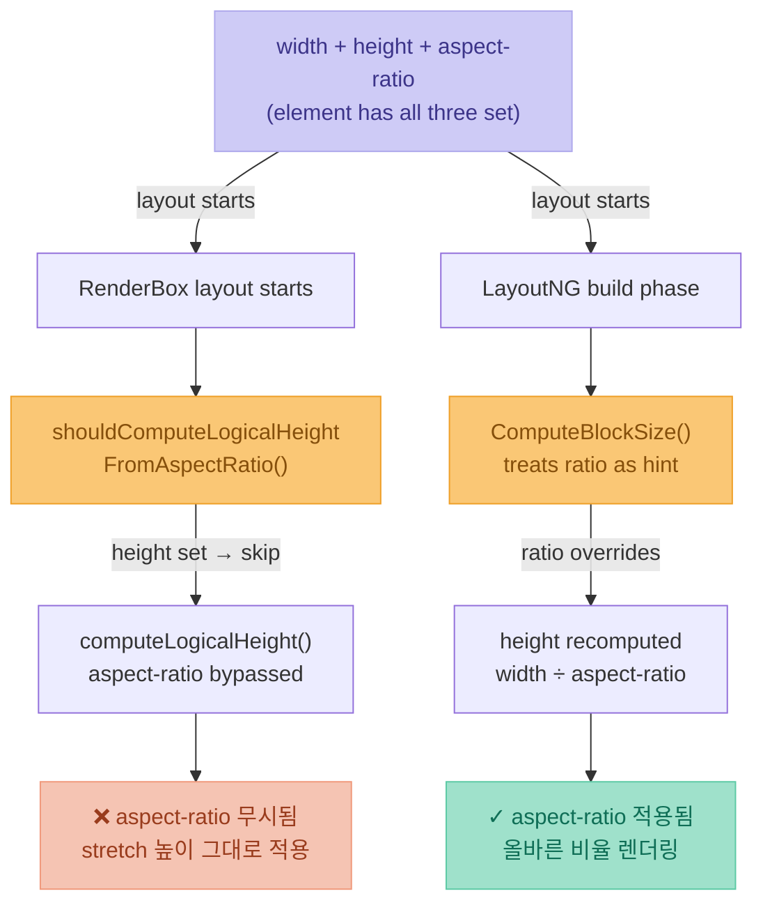

# aspect-ratio Troubleshooting on Safari

> **TL;DR** — Safari에서 렌더링 중 레이아웃이 순간적으로 틀어졌다 복원되는 fluctuation 현상. 부모 div에 `width`/`height`가 **둘 다** 명시된 상태에서 자식 `img`에 `aspect-ratio`를 주면, Safari가 이미지 로딩 중 사이즈를 잘못 계산해 인접 요소를 튕겨낸다. 해결책은 이미지 컴포넌트에서 `aspect-ratio`를 제거하고 `object-fit: cover`로 대체하는 것이다.

---

## 배경

기능 개발 진행 후 확인하는 도중 Safari에서 요소의 높이가 shifting 되었다가 다시 원하는 형태로 복원되는 fluctuation 문제가 발생했다. 디자인 시스템의 공통 이미지 컴포넌트(ex - `ImageComponent`)는 외부에서 `ratio` prop을 받아 내부 `` 태그에 CSS로 `aspect-ratio`를 주입하는 구조였다. Chrome/Firefox에서는 정상 동작했으나, **Safari에서만 렌더링 도중 레이아웃이 순간적으로 틀어졌다가 복원되는 현상**이 발견되었다.

상위 컨테이너의 `width`/`height`가 고정되어 있어 렌더링이 완전히 끝나면 크기와 정렬은 맞춰진다. 그러나 렌더링 완료 이전, 이미지 처리 도중에 요소가 순간적으로 잘못된 크기를 갖고 이 과정에서 위아래 인접 요소들이 `padding`이나 `margin`이 갑자기 생긴 것처럼 튕겨나갔다가 다시 원래 자리로 돌아오는 증상이 반복되었다. 네트워크 속도가 느릴수록 이미지 수신 latency가 길어지면서 현상이 더 뚜렷하게 관측되었다.

아래는 실제 증상을 재현한 애니메이션이다. 아이콘 이미지가 로딩되는 동안 일시적으로 세로로 늘어나 인접한 해시태그 chip들을 36px 아래로 밀어냈다가, 로딩 완료 후 원래 자리로 돌아오는 fluctuation 현상을 보여준다.


---

## 컴포넌트 구조

문제가 발생한 DOM 구조를 대략적으로 표시하면 다음과 같다.

```
flex-container
└── flex-container
      └── flex-container
            └── div.icon-wrapper        ← width: 40px; height: 40px; border-radius: 50%
                  └── ImageComponent    ← aspect-ratio: 1 prop 전달됨
                        └── 
```

### 문제가 된 코드

```vue
<!-- 사용처 -->
<IconWrapper>
  <ImageComponent :src="imgSrc" aspect-ratio="1" />
</IconWrapper>
```

```css
/* IconWrapper */
.icon-wrapper {
  width: 40px;
  height: 40px;
  border-radius: 50%;
  overflow: hidden;
}

/* ImageComponent 내부 — aspect-ratio를 prop으로 주입 */
img {
  aspect-ratio: v-bind(aspectRatio); /* → aspect-ratio: 1 */
}
```

---

## 엔진 처리 흐름 비교

`width + height + aspect-ratio`가 모두 설정된 요소를 두 엔진이 처리하는 방식을 나타낸 다이어그램이다.



> 출처:
> - WebKit: [`WebCore/rendering/RenderBox.cpp` — `shouldComputeLogicalHeightFromAspectRatio()`](https://trac.webkit.org/changeset/271061/webkit)
> - Blink: [`blink/renderer/core/layout/`](https://chromium.googlesource.com/chromium/src/+/refs/heads/main/third_party/blink/renderer/core/layout/)

---

## 원인 분석

### 1. `aspect-ratio`는 weak declaration이다

CSS 스펙상 `aspect-ratio`는 **약한 선언(weak declaration)** 이다. `width`와 `height`가 **둘 다** 명시된 경우, 브라우저는 aspect-ratio를 무시하고 명시된 값을 우선한다.

```css
/* ❌ 이 상태에서 aspect-ratio는 무시된다 */
.icon-wrapper {
  width: 40px;
  height: 40px; /* height가 확정값으로 존재 */
}
img {
  aspect-ratio: 1; /* 무시됨 */
}
```

### 2. 3단 중첩 flex의 `align-items: stretch` 전파

Flexbox의 기본값은 `align-items: stretch`다. 3단 중첩된 flex 컨테이너를 거치면서 이 stretch 값이 누적 전파되어, `.icon-wrapper`의 높이가 flex 라인 높이에 맞게 강제로 늘어날 수 있다. 이렇게 늘어난 높이가 `img`에 전달되면 `aspect-ratio`와 충돌한다.

```
flex (stretch) → flex (stretch) → flex (stretch) → div height 결정
                                                           ↓
                                                   img가 이 height를 받음
                                                   → aspect-ratio 충돌
```

### 3. Safari vs Chrome의 해석 차이

| | Chrome (Blink) | Safari (WebKit) |
|---|---|---|
| `height`가 명시된 상태에서 `aspect-ratio` 처리 | aspect-ratio를 **힌트**로 사용해 재계산 | 명시된 `height`를 **확정값**으로 간주, aspect-ratio 무시 |
| stretch로 전파된 높이 처리 | aspect-ratio가 있으면 높이를 재계산 | 전파된 height를 그대로 확정값으로 사용 |

**Chrome은 aspect-ratio가 있으면 height를 재계산하고, Safari는 height가 있으면 aspect-ratio를 무시한다.**

CSS 스펙이 이 엣지 케이스를 명확하게 정의하지 않기 때문에 두 브라우저 모두 스펙 위반은 아니다. Safari가 스펙에 더 엄격하고, Chrome이 더 관대하게 해석한다고 볼 수 있다.

### 4. Safari + lazy loading → layout fluctuation

`loading="lazy"` 이미지는 로드 전에 intrinsic size를 알 수 없다. Safari에서는 이 상태에서 HTML `width`/`height` attribute 기반의 자동 비율 계산도 적용되지 않아 문제가 복합된다.

> 참고: [WebKit Bugzilla #224197](https://bugs.webkit.org/show_bug.cgi?id=224197)

이 두 가지가 결합되면 다음과 같은 순서로 fluctuation이 발생한다.

```
1. 이미지 로드 전
   → Safari가 aspect-ratio를 무시한 채 stretch 높이로 img 크기를 잡음
   → 잘못된 크기가 상위 flex에 전파 → 인접 요소 밀려남

2. 이미지 수신 완료
   → 컨테이너의 고정 width/height가 최종 기준이 되어 크기 복원
   → 인접 요소 다시 원래 자리로 돌아옴

3. 결과
   → 렌더링 완료 후에는 정상으로 보이지만
   → 네트워크 latency만큼 fluctuation이 지속되어 사용자에게 노출됨
```

이는 Chrome이 `aspect-ratio`를 힌트로 사용해 이미지 로드 전에도 올바른 크기를 미리 계산하는 것과 대비되는 동작이다. Chrome에서는 fluctuation 자체가 발생하지 않는다.

---

## 해결 방법

### 핵심 원칙

> **부모가 `width` + `height`를 둘 다 확정하고 있는 경우, 자식 `img`의 `aspect-ratio`는 무의미하거나 충돌을 유발한다.**  
> 이 경우 `aspect-ratio`의 역할은 `object-fit: cover`로 대체해야 한다.

### 수정된 코드

```vue
<!-- 사용처 — aspectRatio prop 전달 제거 -->
<IconWrapper>
  <ImageComponent :src="imgSrc" />
</IconWrapper>
```

```css
/* IconWrapper — 크기와 모양을 여기서 확정 */
.icon-wrapper {
  width: 40px;
  height: 40px;
  border-radius: 50%;
  overflow: hidden;
  flex-shrink: 0; /* flex 환경에서 찌그러짐 방지 */
}

/* ImageComponent 내부 — 부모를 채우는 역할만 담당 */
img {
  width: 100%;
  height: 100%;
  object-fit: cover; /* 비율 유지하며 크롭, aspect-ratio 대체 */
  display: block;    /* inline 기본값의 baseline 공백 제거 */
  /* aspect-ratio 제거 */
}
```

### aspectRatio prop이 반드시 필요한 경우

만약 컴포넌트 외부에서 비율을 제어해야 하는 요구사항이 있다면, **`img`가 아닌 wrapper `div`에 `aspect-ratio`를 적용하고 `height`는 제거**한다.

```css
/* ✅ aspect-ratio는 wrapper에서 제어, height는 제거 */
.icon-wrapper {
  width: 40px;
  /* height 제거 */
  aspect-ratio: v-bind(aspectRatio); /* 1, 16/9 등 외부에서 주입 */
  border-radius: 50%;
  overflow: hidden;
  flex-shrink: 0;
}

img {
  width: 100%;
  height: 100%;
  object-fit: cover;
  display: block;
}
```

---

## 수정 전/후 비교

| | 수정 전 | 수정 후 |
|---|---|---|
| 비율 제어 위치 | `img` (자식) | 제거 / wrapper로 이동 |
| Safari 증상 | 렌더링 중 fluctuation → 인접 요소 튕김 | 없음 |
| 저속 네트워크 | 증상 심화 (이미지 latency에 비례) | 무관 |
| Chrome/Firefox 동작 | 정상 (관대한 해석) | 정상 |
| 이미지 크롭 방식 | 미정의 | `object-fit: cover` |

---

## 타 라이브러리의 설계 판단

같은 문제를 어떻게 회피했는지 주요 라이브러리를 비교하면, 이번 픽스 방향이 업계 표준과 일치함을 확인할 수 있다.

### Chakra UI v3 `<Image>`

`aspectRatio` prop을 받지만, **`img` 자체에는 절대 `aspect-ratio`를 주지 않는다.** 내부 구조는 다음과 같다.

```tsx
// Chakra UI Image — aspectRatio prop 전달 시 내부 렌더링 구조
<Box
  position="relative"
  aspectRatio={ratio}     // ← wrapper Box에만 aspect-ratio 적용
  overflow="hidden"
>
  
</Box>
```

`img`에 `position: absolute`를 주는 것이 핵심이다. absolute 요소는 flex formatting context에서 이탈하기 때문에 부모 flex의 `align-items: stretch` 전파 경로 자체가 끊어진다. wrapper Box는 `height`를 명시하지 않은 채 `aspect-ratio`만 갖기 때문에 Safari의 `shouldComputeLogicalHeightFromAspectRatio()`가 `true`를 반환해 비율 계산이 정상 작동한다.

> 참고: [Chakra UI Image 컴포넌트 문서](https://chakra-ui.com/docs/components/image)

### Next.js `<Image>`

`width` + `height` prop을 필수로 받아 크기를 미리 확정한다. `aspect-ratio`는 사용하지 않는다.

```tsx
// Next.js Image — 내부 렌더링
<span style={{ display: "inline-block", width, height }}>
  
</span>
```

이미지 로드 전에도 공간이 pixel 단위로 확정되기 때문에 CLS(Cumulative Layout Shift)가 0이 된다.

### 세 접근 비교

| | 직접 `aspect-ratio` (문제 케이스) | Next.js `<Image>` | Chakra UI `<Image>` |
|---|---|---|---|
| 비율 제어 위치 | `img` 직접 | width + height 명시 | wrapper `Box` |
| `img` position | flex child (static) | static / absolute | `absolute` (inset: 0) |
| flex stretch 영향 | 받음 (Safari 문제 원인) | 없음 | 없음 |
| Safari 안전성 | 불안정 | 안정 | 안정 |
| 공통 원칙 | — | `img`에 `aspect-ratio` 주지 않음 | `img`에 `aspect-ratio` 주지 않음 |

---

## 부록: flex `align-items: stretch` 기본값 이해하기

Safari 버그의 근본 원인이 되는 `align-items: stretch` 기본값의 동작을 세 단계로 정리한다.

### 1단계: stretch (기본값) — 버그 발생

`align-items`를 명시하지 않으면 `stretch`가 적용된다. 가장 키가 큰 flex 자식의 높이로 모든 자식이 맞춰진다.

```
flex-container (align-items: stretch — 기본값)
  ├── sibling (height: 96px — 가장 키 큰 자식)
  └── icon-wrapper (height: 96px ← stretch로 결정)
        └── img (height: 100% = 96px, aspect-ratio 무시됨)
```

```css
.flex-container { display: flex; /* align-items 미지정 → stretch */ }
.icon-wrapper   { width: 44px; /* height 없음 → stretch로 결정 */ }
img             { aspect-ratio: 1; /* Safari에서 무시됨 */ }
```

### 2단계: flex-start 적용 — stretch 해제

```
flex-container (align-items: flex-start)
  ├── sibling (height: 96px)
  └── icon-wrapper (height: 44px ← 자체 크기 유지)
        └── img (height: 100% = 44px, aspect-ratio 정상)
```

```css
.flex-container { display: flex; align-items: flex-start; }
.icon-wrapper   { width: 44px; height: 44px; }
img             { width: 100%; height: 100%; object-fit: cover; }
```

### 3단계: position: absolute 분리 — Chakra UI 방식

`img`를 `position: absolute`로 꺼내면 flex formatting context를 완전히 이탈해 stretch 전파 경로 자체가 차단된다.

```
flex-container
  └── icon-wrapper (position: relative, aspect-ratio: 1, width: 44px)
                    → 높이: 44px (aspect-ratio로 결정)
        └── img (position: absolute, inset: 0)
                    → flex 자식 아님 → stretch 무관
```

```css
.icon-wrapper {
  width: 44px;
  aspect-ratio: 1;    /* wrapper에서 비율 제어 */
  position: relative;
  border-radius: 50%;
  overflow: hidden;
}
img {
  position: absolute; /* flex context 이탈 */
  inset: 0;
  width: 100%;
  height: 100%;
  object-fit: cover;
}
```

### align-items: stretch가 중첩 flex에서 전파되는 과정

3단 중첩 flex에서는 이 효과가 누적된다.

```
flex-A (stretch) → flex-B (stretch) → flex-C (stretch) → icon-wrapper 최종 height 결정
                                                                 ↓
                                                   img가 이 height를 받음 → aspect-ratio 충돌
```

각 레벨을 통과할 때마다 stretch는 자식의 cross-axis 크기를 컨테이너에 맞게 확장한다. 중첩이 깊을수록 최종 img에 전달되는 height가 예상 밖의 값이 될 가능성이 높다.

---

## 관련 자료

- [MDN — aspect-ratio](https://developer.mozilla.org/en-US/docs/Web/CSS/aspect-ratio)
- [QuirksBlog — aspect-ratio in flex/grid context](https://www.quirksmode.org/blog/archives/2021/05/aspectratio.html)
- [Jack Duvall's Blog — A Safari aspect-ratio CSS Bug](https://blog.duvallj.pw/posts/2024-09-14-safari-css-bug.html)
- [WebKit Bugzilla #224197 — lazy loaded images aspect-ratio](https://bugs.webkit.org/show_bug.cgi?id=224197)
- [Can I use — aspect-ratio](https://caniuse.com/?search=aspect-ratio)
- [Chakra UI — Image 컴포넌트](https://chakra-ui.com/docs/components/image)
- [Next.js — Image 컴포넌트](https://nextjs.org/docs/app/api-reference/components/image)