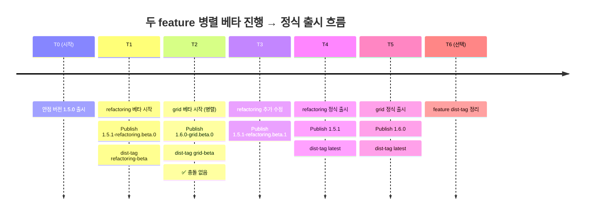
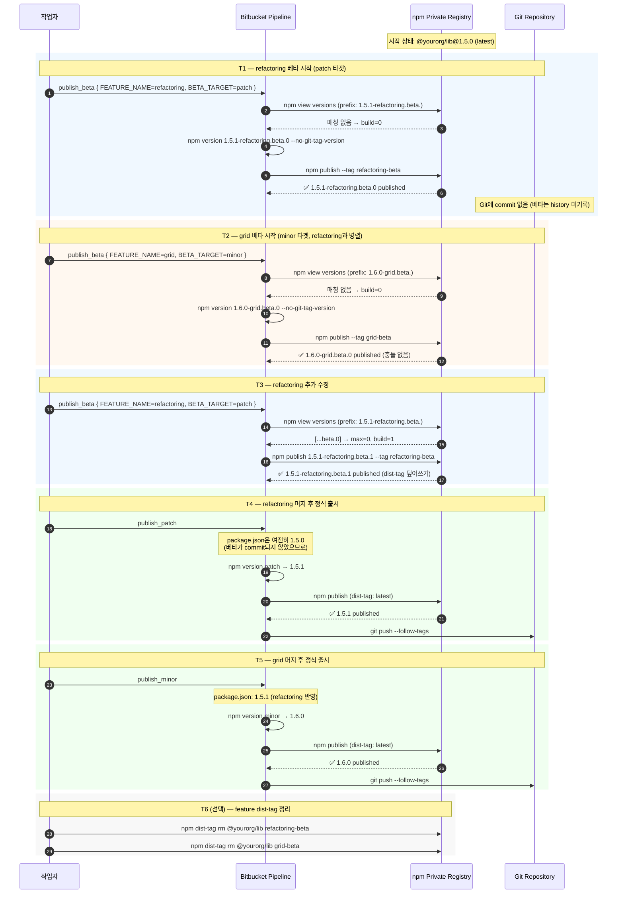
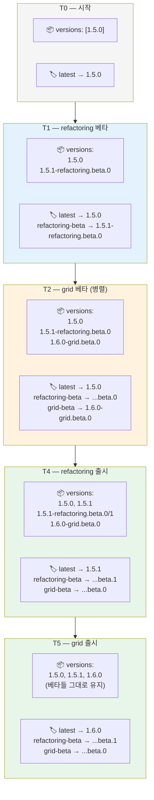

# 📦 npm Private Registry 병렬 베타 배포 파이프라인 개선 제안

> SemVer · Prerelease · Feature-Scoped Versioning · Bitbucket Pipelines
>
> 라이브러리 운영이 집중 개발기에서 안정화 후 병렬 기술 과제 수행기로 전환됨에 따라, 버저닝 전략의 진화 방향을 함께 논의하기 위한 제안 문서

---

## 목차

1. [TL;DR](#tldr)
2. [개요](#-개요)
3. [SemVer 기초 정리](#-semver-기초-정리)
4. [버저닝 전략 전환의 배경](#-버저닝-전략-전환의-배경)
5. [업계 벤치마킹: 어떤 전략들이 있나](#-업계-벤치마킹-어떤-전략들이-있나)
6. [제안하는 전략 — 단계적 결정 사항](#-제안하는-전략--단계적-결정-사항)
7. [Before / After 비교](#-before--after-비교)
8. [최종 파이프라인 구현](#-최종-파이프라인-구현)
9. [운영 흐름 예시](#-운영-흐름-예시)
10. [운영 시 고려할 엣지케이스](#-운영-시-고려할-엣지케이스)
11. [📚 참고 자료](#-참고-자료)

---

## TL;DR

라이브러리 초기 집중 개발기에는 **단일 feature branch에 여러 명이 모여 작업하고 한 번에 버전업하는 직렬 모델**로 충분했고, 기존 `npm version prerelease --preid=beta` 기반 파이프라인은 이 운영 모드에 잘 맞았다. 라이브러리의 큰 그림이 완성되고 컴포넌트 리팩토링·기술 전환·신규 컴포넌트 추가 등 **여러 기술 과제를 병렬로 진행하는 단계**로 넘어오면서, 동시에 진행되는 두 feature가 동일한 `1.5.1-beta.0`을 발급받아 publish가 막히는 상황이 나타났다. 이는 기존 파이프라인의 결함이 아니라 **운영 모델 변화에 따라 버저닝 전략의 진화가 필요한 시점**이라는 신호다. 본 문서는 그 진화의 방향을 팀과 함께 논의하기 위한 제안 자료이며, 각 결정 항목은 채택 여부를 함께 검토하는 것을 전제로 한다. 제안하는 방향대로 진행될 경우 결과 형식은 `1.5.1-refactoring.beta.0`, `1.6.0-grid.beta.0`처럼 표준 SemVer 2.0.0에 부합하면서 사람이 읽기 좋고, 컨슈머는 정확한 버전을 `package.json`에 pinning하여 재현 가능한 베타 테스트가 가능해진다.

---

## 📌 개요

| 항목 | 내용 |
|---|---|
| 대상 | 컴포넌트 라이브러리 (standalone repo) |
| 배포 채널 | npm Private Registry |
| CI/CD | Bitbucket Pipelines (custom pipelines로 beta / patch / minor 분리 운영) |
| 컨슈머 | 같은 organization 내 별도 웹 프로젝트들 |
| 이전 운영 모드 | 단일 feature branch 집중 개발 → 한 번에 버전업 (직렬) |
| 현재 운영 모드 | 컴포넌트 리팩토링·기술 전환·신규 컴포넌트 추가의 병렬 진행 |
| 전환의 계기 | 병렬 베타 시 동일 prerelease 버전 발급으로 publish 충돌 발생 |
| 진화 방향 (제안) | Feature-scoped preid + 자동 build counter + 명시적 base target |
| 영향 범위 | `npm_publish` step 스크립트 + `publish_beta` 파이프라인의 입력 변수 |
| 문서 성격 | 의사결정 제안서 — 각 항목은 팀 논의 후 채택 여부 결정 |

---

## 🔢 SemVer 기초 정리

본격적인 전략 논의 전, 팀원 모두가 같은 어휘를 쓸 수 있도록 SemVer 2.0.0 표준의 핵심을 정리한다.

### 기본 형식

```
MAJOR . MINOR . PATCH
```

| 자릿수 | 언제 올리나 | 호환성 | 예시 변경 |
|---|---|---|---|
| **MAJOR** | API에 backward-incompatible 변경 발생 | ❌ 깨짐 | 기존 prop 제거, 컴포넌트 시그니처 변경 |
| **MINOR** | backward-compatible한 신규 기능 추가 | ✅ 유지 | 새 컴포넌트 추가, 새 prop (optional) 추가 |
| **PATCH** | backward-compatible한 버그 수정 | ✅ 유지 | 스타일 오류 수정, 내부 로직 fix |

> 핵심: **호환성을 깨는 변경은 반드시 MAJOR**. "조금 깨는 정도라 minor로 가도 되지 않나"는 SemVer 위반이며 컨슈머에게 silent failure를 안긴다.

### Prerelease Identifier

PATCH 뒤에 하이픈(`-`)을 붙이고 점(`.`)으로 구분된 식별자를 이어붙이면 prerelease 버전이 된다.

```
1.5.0-alpha
1.5.0-alpha.1
1.5.0-beta.2
1.5.0-rc.1
1.5.0-refactoring.beta.0          ← dot-segment로 다층 식별자 가능
```

**표준 규칙 (semver.org spec)**

- 식별자는 ASCII 영숫자와 하이픈만 (`[0-9A-Za-z-]`)
- 식별자는 비어있을 수 없음
- 숫자 식별자는 leading zero 금지 (`1.0.0-01`은 invalid)
- prerelease 버전은 동일 normal 버전보다 **낮은 precedence**를 가짐
  - 즉 `1.5.0-beta.0` < `1.5.0`
- dot-separated 식별자는 좌→우로 순차 비교
  - `1.5.0-alpha < 1.5.0-alpha.1 < 1.5.0-beta < 1.5.0-rc.1 < 1.5.0`

### npm의 prerelease 취급 방식

npm은 SemVer range 매칭에서 **기본적으로 prerelease를 포함하지 않는다.**

```json
{ "dependencies": { "my-lib": "^1.5.0" } }
```

위 range는 `1.5.0`, `1.6.0`, `1.7.3`을 매칭하지만 `1.5.1-beta.0`은 **매칭하지 않는다.** 이 동작 덕분에 베타가 stable 컨슈머에게 실수로 흘러가지 않는다.

베타를 받으려면 컨슈머가 두 방법 중 하나로 명시적으로 받아야 한다:

```bash
# 방법 1: dist-tag로 받기 (최신 베타로 자동 갱신됨)
npm install my-lib@beta

# 방법 2: 정확한 버전 pinning (재현 가능)
npm install my-lib@1.5.1-refactoring.beta.0
```

### dist-tag

npm의 dist-tag는 **버전에 붙는 이름표**다. git tag와 유사하지만 mutable하며, registry에서 "이 이름은 지금 이 버전을 가리킨다"를 표시한다.

```bash
npm publish                    # 기본적으로 latest 태그로 publish
npm publish --tag beta         # beta 태그로 publish
npm dist-tag ls my-lib         # 모든 dist-tag 목록 조회
npm dist-tag rm my-lib beta    # dist-tag 제거
```

`latest`는 `npm install` 시 (별도 지정 없을 때) 기본으로 설치되는 버전을 가리키는 특별한 태그다.

---

## 🔄 버저닝 전략 전환의 배경

### 이전 운영 모드 — 직렬 집중 개발기

라이브러리 초기에는 운영 모델이 명확했다.

- **하나의 feature branch에 여러 명이 모여 작업**
- 작업이 완료되면 **한 번에 버전업** (베타 → 검증 → patch / minor로 promote)
- 같은 시점에 라이브러리 다른 부분이 별도 branch로 동시 진행되는 일이 거의 없음

이 운영 모드에서는 prerelease counter가 단일이어도 충돌이 발생하지 않았다. 베타 → patch promote 사이클이 항상 직렬이었기 때문이다.

### 기존 publish step의 동작

```bash
LOCAL_PACKAGE_VERSION=$(node -p -e "require('./package.json').version")
if [ $UPDATE_VERSION == 'beta' ]; then
  npm version prerelease --preid=beta -m "Upgrade to %s [skip ci]"
else
  npm version $UPDATE_VERSION -m "Upgrade to %s [skip ci]"
fi
# ... publish 후
git push --follow-tags
```

`npm version prerelease --preid=beta`는 `package.json`의 현재 버전을 기반으로 단일 prerelease counter를 1 증가시킨다.

| 현재 버전 | 명령 실행 후 |
|---|---|
| `1.5.0` | `1.5.1-beta.0` |
| `1.5.1-beta.0` | `1.5.1-beta.1` |
| `1.5.1-beta.1` | `1.5.1-beta.2` |

직렬 모델에서는 이 단일 counter가 곧 라이브러리 전체의 "다음 베타 후보 번호"였고, 자연스러운 진행이었다.

### 현재 운영 모드 — 안정화 후 병렬 기술 과제 수행기

라이브러리의 큰 그림이 완성된 후, 운영 모드가 바뀌었다.

- **컴포넌트 리팩토링** — 기존 컴포넌트를 점진적으로 개선
- **기술 전환** — 빌드 도구 / 디자인 토큰 시스템 등 인프라 레벨 업그레이드
- **신규 컴포넌트 추가** — 라이브러리 surface 확장
- 각각이 **별도의 feature branch에서 병렬로 진행**되며, 베타 → 정식 출시 사이클도 각자의 속도로 흘러감

병렬화는 더 이상 예외 상황이 아니라 **상시 운영 모드**가 되었다.

### 단일 counter가 병렬 모드와 만났을 때

이 새로운 운영 모드에서 기존 단일 counter 방식의 한계가 드러난다.

```
[시점 T0]
main 브랜치 package.json: 1.5.0

[시점 T1] feature/refactoring 브랜치 작업자가 publish_beta 실행
  - LOCAL_PACKAGE_VERSION = 1.5.0
  - npm version prerelease → 1.5.1-beta.0
  - registry에 1.5.1-beta.0 publish 성공
  - git push로 feature/refactoring 브랜치에 commit (package.json: 1.5.1-beta.0)

[시점 T2] feature/grid 브랜치 작업자가 publish_beta 실행 (병렬)
  - feature/grid는 1.5.0에서 분기됨
  - LOCAL_PACKAGE_VERSION = 1.5.0 (feature/refactoring의 commit과 격리됨)
  - npm version prerelease → 1.5.1-beta.0
  - registry에 publish 시도 → ❌ 409 Conflict
```

### 기존 전략의 가정과 현재 요구 사이의 간극

기존 파이프라인이 잘못 설계된 것이 아니라, **그 시점의 운영 모델 가정 위에서 설계된 도구**였다. 운영 모델이 바뀐 지금, 그 가정과 새로운 요구 사이에 세 가지 간극이 보인다.

| 기존 전략의 가정 | 현재 운영 모드의 요구 |
|---|---|
| 베타 카운터는 라이브러리 전체에 하나면 충분하다 | feature별로 독립된 카운터가 필요하다 |
| 베타도 git history에 남겨 추적한다 | 병렬 branch 간 `package.json` state 격리가 필요하다 |
| 컨슈머는 dist-tag 없이도 어떤 베타인지 알 수 있다 | feature 단위로 명확한 라벨이 있어야 컨슈머가 구분 가능하다 |

다음 섹션부터는 이 간극을 메우기 위해 업계는 어떤 전략을 사용하는지 살펴보고, 우리 환경에 맞는 조합으로 어떤 방향을 제안하는지 정리한다.

---

## 🌐 업계 벤치마킹: 어떤 전략들이 있나

병렬 베타 운영은 라이브러리 생태계에서 흔히 마주치는 단계이며, 대형 OSS들은 이미 자신만의 방식으로 이 단계를 거쳐왔다. 각 전략과 그 출처를 정리한다.

### 1. React Release Channels

React는 `Latest`, `Canary`, `Experimental` 세 채널을 운영한다.

- **Latest**: 전통적인 SemVer를 엄수하는 stable 채널
- **Canary**: main 브랜치를 추적하는 prerelease 채널. **컨슈머에게 pin을 요구하며 breaking change가 포함될 수 있다고 명시.**
- **Experimental**: 빌드 내용과 커밋 날짜로 unique한 버전 생성 (예: `0.0.0-experimental-68053d940-20210623`). **충돌이 구조적으로 불가능한 패턴.**

> 시사점: 비-stable 채널은 SemVer를 느슨하게 쓰되, 컨슈머에게 명시적 pinning을 요구하는 것이 표준 운영 방식이다.

출처: [React Versioning Policy](https://react.dev/community/versioning-policy), [React Canaries 공식 블로그](https://react.dev/blog/2023/05/03/react-canaries)

### 2. Next.js Stable / Canary 채널

Next.js는 두 채널만 운영한다.

- **Stable**: `npm install next` 시 받는 기본 채널, semver 엄수
- **Canary**: `npm install next@canary`로 명시적 설치, stable로 갈 모든 변경사항을 미리 담는 채널

> 시사점: 채널을 단순화하더라도 dist-tag로 명확히 분리하면 운영이 깔끔하다.

출처: [Next.js Release Channels 문서](https://github.com/vercel/next.js/blob/canary/contributing/repository/release-channels-publishing.md)

### 3. semantic-release Pre-release Branches

semantic-release는 **branch 단위로 prerelease identifier를 매핑**한다.

```
main 브랜치 → @latest, semver 엄수 (예: 1.0.1)
beta 브랜치 → @beta, 2.0.0-beta.1, 2.0.0-beta.2 ...
alpha 브랜치 → @alpha, 3.0.0-alpha.1 ... (병렬 major 작업)
```

> 시사점: 병렬 prerelease는 **branch별 long-lived branch + 각자의 preid**로 풀 수 있다.

출처: [semantic-release Pre-releases 공식 recipe](https://semantic-release.gitbook.io/semantic-release/recipes/release-workflow/pre-releases)

### 4. Oleksii Popov의 Branch-Scoped Alias 패턴

Branch 이름을 prerelease identifier alias로 박는 실용 패턴.

```
feature/sunfish 브랜치 → v0.0.2-sunfish.0
컨슈머: npm install pkg@sunfish
```

> 시사점: 회사 내부에서 dist-tag와 preid를 branch/feature name과 1:1로 매핑하면 충돌이 원천 차단된다.

출처: [Feature branches approach in CI/CD of NPM libraries — Oleksii Popov](https://oleksiipopov.com/blog/feature-branches-approach-in-ci-cd-of-npm-libraries/)

### 5. Changesets Snapshot 모드

Changesets는 `--snapshot <tag>` 옵션으로 `{tag}-{datetime}` 형태의 일회성 버전을 발급한다. 1.0+ 에서는 `snapshot.prereleaseTemplate` 설정으로 commit SHA 등 커스텀 식별자 조합 가능.

> 시사점: 본 프로젝트는 Changesets를 도입하지 않지만, "registry에 누적되는 임시 버전 + tag-based 식별"이라는 컨셉을 차용할 수 있다.

출처: [Changesets Prereleases 문서](https://github.com/changesets/changesets/blob/main/docs/prereleases.md), [snapshot.prereleaseTemplate PR](https://github.com/changesets/changesets/pull/858)

### 벤치마킹 종합

각 전략의 핵심 아이디어를 추리면:

| 아이디어 | 출처 |
|---|---|
| Feature/branch name을 preid에 박아 카운터 분리 | Oleksii Popov, semantic-release |
| Build identifier(SHA, build number)로 unique 버전 보장 | React Experimental, Changesets snapshot |
| dist-tag로 feature별 채널 분리 + 컨슈머는 pinning 권장 | React Canary, Next.js canary |
| Prerelease는 git history에 commit하지 않음 | React, Next.js, semantic-release (자동화) |

이 네 가지 아이디어를 우리 환경에 맞게 조합하는 방향을 제안한다.

---

## 🪜 제안하는 전략 — 단계적 결정 사항

병렬 운영 모드의 요구를 만족시키면서도 표준 SemVer 위에서 동작하고, 컨슈머의 기존 사용 패턴(직접 pinning)을 깨지 않는 방향으로, 아래와 같은 단계적 결정 사항을 제안한다. **각 항목은 팀 논의를 거쳐 채택 여부를 함께 결정하는 것을 전제로 한다.** 각 제안에 대해 "왜 이 방향을 고려하는가", "도입 시 기대 효과", 그리고 "검토한 다른 대안"을 함께 정리하여 의사결정에 필요한 맥락을 제공한다.

---

### 제안 1. Feature-scoped Prerelease Identifier

**제안 내용**: prerelease identifier에 feature name을 dot-segment로 포함시켜 카운터를 feature별로 분리한다.

```
{base}-{feature}.beta.{build}

예:
1.5.1-refactoring.beta.0
1.5.1-grid.beta.0  ← refactoring과 완전히 독립된 식별자 공간
```

**왜 이 방향을 고려하는가**

- 현재 운영 모드에서 가장 시급한 요구는 "병렬 feature가 서로 충돌하지 않는 베타 버전 발급"이다.
- SemVer 2.0.0은 dot-separated identifier를 표준으로 명시 허용하므로, 추가 도구나 비표준 컨벤션 없이 표준 위에서 해결 가능하다.
- feature name이 버전 문자열에 박혀있으면 어떤 베타가 어떤 작업의 산출물인지를 별도 메타데이터 없이도 식별할 수 있다.

**도입 시 기대 효과**

- ✅ **충돌이 구조적으로 불가능해진다** — 두 feature가 서로 다른 식별자 공간을 갖기 때문에 동시 publish가 정상 동작한다.
- ✅ **feature 시작 시 사전 조율이 불필요해진다** — 작업자들이 "베타 카운터 누가 쓰고 있나"를 확인할 필요 없이 자신의 작업을 진행할 수 있다.
- ✅ **베타 버전을 슬랙/PR에 공유할 때 문맥이 즉시 전달된다** — `1.5.1-refactoring.beta.2`를 보면 "refactoring 작업의 3번째 베타구나"가 한눈에 읽힌다.

**검토한 다른 대안**

| 대안 | 장점 | 단점 |
|---|---|---|
| Branch별 long-lived 브랜치 + 각자 preid (semantic-release 스타일) | 자동화 도구가 잘 갖춰져 있음 | semantic-release 도입 비용, 현재 파이프라인 구조와 결합도 높음 |
| 매 publish마다 새 major/minor 사용 | 충돌 없음 | 버전 번호가 빠르게 인플레이션됨, SemVer 의미 왜곡 |

---

### 제안 2. SemVer-Clean Format 선호 (SHA suffix 배제)

**제안 내용**: feature 이름 뒤에 build counter를 두는 깔끔한 형태(`refactoring.beta.0`)를 사용한다. commit SHA를 suffix로 박는 방식(`refactoring.a3f9c12`)은 채택하지 않는다.

**왜 이 방향을 고려하는가**

- 우리 라이브러리는 내부 컴포넌트 라이브러리이며, PRD 진행 중 **개발자들이 베타 버전을 슬랙·PR·구두로 공유하는 일이 잦다.**
- 사람이 베타 버전 문자열을 읽었을 때 "refactoring feature의 3번째 베타"임이 직관적으로 파악되어야 협업 효율이 높다.
- 컨슈머가 베타 버전을 `package.json`에 직접 pinning하는 패턴이 정착되어 있어, 그 문자열 자체가 인간 가독성을 가져야 한다.

**도입 시 기대 효과**

- ✅ **베타 버전이 자기 문서화된다** — 별도 메타데이터 없이 버전 문자열만 봐도 의미가 읽힌다.
- ✅ **시퀀스성이 보존된다** — `refactoring.beta.0` < `refactoring.beta.1` < `refactoring.beta.2`가 명확하여 "어느 게 최신인지" 한눈에 알 수 있다.
- ✅ **회의·문서에서 인용이 편하다** — "refactoring 베타 2번"이라고 부르면 곧장 `refactoring.beta.2`로 매핑된다.

**검토한 다른 대안**

| 대안 | 장점 | 단점 |
|---|---|---|
| SHA suffix (`refactoring.a3f9c12`) | 자동화 단순, 충돌 100% 불가능 | 가독성 떨어짐, 시퀀스 비교 불가, 구두 공유 어려움 |
| Timestamp suffix (`refactoring.20260526-1430`) | 시간 순서 직관적 | 길고 번잡, 분 단위 충돌 가능성 |
| 단순 hash (`refactoring.abc`) | 짧음 | 의미 없음, 가독성 없음 |

---

### 제안 3. Build Counter는 Registry 조회로 자동 계산

**제안 내용**: `npm view <pkg> versions --json`으로 동일 prefix(`{target}-{feature}.beta.`)를 가진 기존 버전들을 조회하여 max build number를 찾고, +1한 값을 새 build number로 사용한다.

**왜 이 방향을 고려하는가**

- 제안 2에서 SemVer-clean 형식을 택하면 0부터 시작하는 깔끔한 카운터가 필요하다.
- Registry는 이미 모든 발행 버전의 source of truth이므로, 카운터를 별도로 관리하는 곳을 두지 않아도 된다.
- 개발자가 카운터를 수동으로 입력하거나 관리할 필요가 없어야 자동화 가치가 살아난다.

**도입 시 기대 효과**

- ✅ **feature별로 0부터 시작하는 깨끗한 시퀀스** — refactoring은 `refactoring.beta.0, 1, 2...`, grid는 `grid.beta.0, 1, 2...` 독립 카운터.
- ✅ **상태 관리 위치가 단일하다** — registry만이 카운터의 source of truth.
- ✅ **개발자의 인지 부담 없음** — `FEATURE_NAME`만 입력하면 카운터는 자동 계산된다.

**검토한 다른 대안**

| 대안 | 장점 | 단점 |
|---|---|---|
| `$BITBUCKET_BUILD_NUMBER` 사용 | 단순, race 없음 | 전역 카운터라 숫자가 띄엄띄엄해짐 (`refactoring.beta.47` → `refactoring.beta.83`), 가독성 저하 |
| Git commit count 사용 | branch별 독립 | branch 시점에 따라 숫자가 들쭉날쭉, rebase 시 변경됨 |
| 개발자가 직접 입력 | 완전 제어 | 휴먼 에러, 중복 가능성 |

**고려할 점**

- 같은 feature branch에서 동시 publish 시 race condition 가능성이 이론상 존재한다 → Bitbucket Deployment의 `Concurrency: 1` 설정으로 방지 가능 (운영 시 적용 권장).

---

### 제안 4. `BETA_TARGET` 변수로 Base 버전 명시

**제안 내용**: 베타 publish 시 `BETA_TARGET=patch | minor` 변수를 받아 base 버전을 분기 계산한다.

| BETA_TARGET | base 계산 | 예 (현재 stable 1.5.0) |
|---|---|---|
| `patch` (기본값) | `c+1` | `1.5.1-{feat}.beta.{n}` |
| `minor` | `b+1.0` | `1.6.0-{feat}.beta.{n}` |

**왜 이 방향을 고려하는가**

- 베타 버전 문자열의 base 숫자가 최종 출시 버전과 다르면 컨슈머에게 **잘못된 SemVer 신호**가 된다.
- 예: 신규 컴포넌트 추가 작업은 minor 출시인데 베타가 `1.5.1-grid.beta.0`으로 발급되면, 컨슈머는 "패치겠구나" 오해할 수 있다.
- 작업의 의도(patch인가 minor인가)를 베타 단계부터 명시하면, 머지 시점에 patch/minor 선택을 두고 발생하는 혼선이 줄어든다.

**도입 시 기대 효과**

- ✅ **베타 버전만으로 최종 출시 형태 예측 가능** — `1.6.0-grid.beta.0`을 본 개발자는 "다음 minor에 들어갈 기능이구나"를 즉시 파악.
- ✅ **PR 리뷰 시 의도 명확화** — 베타 publish 변수를 본 리뷰어가 작업 분류를 자연스럽게 인지.
- ✅ **patch/minor 머지 시점의 의사결정 일관성** — 베타 단계와 정식 출시 단계의 분류가 일치.

**검토한 다른 대안**

| 대안 | 장점 | 단점 |
|---|---|---|
| 무조건 patch base 사용 | 단순, 변수 없음 | minor 작업의 의도를 베타가 못 표현, 컨슈머 오해 가능 |
| 무조건 minor base 사용 | 보수적 | patch 작업도 minor base로 가서 stable 버전 인플레이션 |
| `0.0.0` placeholder (React Experimental 방식) | 깔끔, 매핑 고민 없음 | 베타만 보고 stable 버전을 추정할 수 없음, 내부 협업에 부적합 |

**고려할 점**

- 기본값이 `patch`이므로 minor일 때만 명시하면 된다 → 작업자 부담 최소.
- 베타 진행 중 patch → minor로 분류 전환 시 base가 바뀌면서 build counter가 0부터 새로 시작 (운영 흐름 예시 참고).

---

### 제안 5. dist-tag는 자동 발급, 컨슈머는 Pinning이 표준

**제안 내용**: 베타 publish 시 dist-tag를 `{feature}-beta`로 자동 발급한다. 단, 컨슈머의 표준 사용법은 **dist-tag가 아닌 정확한 버전 pinning**으로 사내 가이드에 명시한다.

```bash
# ❌ 비권장 (자동 갱신되어 빌드 재현성 깨질 수 있음)
npm install @yourorg/lib@refactoring-beta

# ✅ 권장 (재현 가능한 빌드)
"@yourorg/lib": "1.5.1-refactoring.beta.2"
```

**왜 이 방향을 고려하는가**

- 현재 컨슈머들이 이미 `"private-library": "1.4.12-beta.0"` 형태로 직접 pinning하여 사용 중이다.
- 직접 pinning은 사실 비-stable 채널에서 **권장되는 패턴**이다 (React Canary 정책과 일치). 베타가 갑자기 업데이트되어 컨슈머 빌드가 깨지는 사고를 막아준다.
- dist-tag는 입력값으로 받아도 거의 미사용되고 있다는 현재 실태를 반영하여, 자동 발급으로 전환하되 역할을 "최신 베타 인덱스"로 재정의한다.

**도입 시 기대 효과**

- ✅ **컨슈머 워크플로 변경 없음** — 이미 정착된 pinning 패턴이 그대로 권장 방식이 된다.
- ✅ **재현 가능한 베타 테스트** — 컨슈머가 어제 테스트한 베타와 오늘 테스트한 베타가 동일함이 보장된다.
- ✅ **dist-tag는 보조 인덱스로 활용** — "지금 refactoring 최신 베타가 뭐였지?" 같은 조회 용도로 자연스럽게 자리잡음.
- ✅ **베타 publish 시 pinning 문자열 자동 출력** — 파이프라인 출력에 `"@yourorg/lib": "1.5.1-refactoring.beta.2"` 형식으로 찍어 컨슈머가 복붙 가능.

**검토한 다른 대안**

| 대안 | 장점 | 단점 |
|---|---|---|
| dist-tag만 사용 (`@refactoring-beta`로 자동 갱신) | 컨슈머 입장에서 "최신 받기" 편리 | 빌드 재현성 깨짐, 컨슈머가 의도치 않은 베타 받을 수 있음 |
| Pinning만 허용, dist-tag 미발급 | 가장 단순 | 최신 베타 조회 수단 부재, 운영 가시성 떨어짐 |

---

### 제안 6. 베타는 Git에 Commit하지 않음

**제안 내용**: 베타 publish 시 `npm version <ver> --no-git-tag-version`을 사용하여 `package.json`만 일시적으로 변경하고 git push하지 않는다. patch / minor는 기존대로 commit + push.

**왜 이 방향을 고려하는가**

- 베타가 git history에 박히면 branch마다 `package.json` version state가 다르게 흘러가 race condition을 만든다 (현재 충돌의 근본 원인 중 하나).
- main 브랜치 `package.json`이 항상 마지막 stable 상태로 유지되어야 `npm version patch / minor`가 의도대로 깨끗하게 동작한다.
- Registry가 이미 베타의 source of truth 역할을 하고 있으므로, git에 추가로 기록할 필요가 없다.

**도입 시 기대 효과**

- ✅ **`package.json` 충돌 / merge conflict 발생 빈도 감소** — 베타가 branch 간 격리되어 진행됨.
- ✅ **patch 계산 정확성 보장** — main의 `package.json`이 항상 깨끗한 stable이라 `npm version patch`가 예측 가능.
- ✅ **Git history 노이즈 감소** — "Upgrade to 1.5.1-beta.0 [skip ci]" 류 commit이 사라짐.
- ✅ **역할 분담 명확화** — Registry = 모든 베타의 source of truth, Git = stable 릴리스 history.

**검토한 다른 대안**

| 대안 | 장점 | 단점 |
|---|---|---|
| 베타도 git commit + push (현재 방식) | 추적 가능 | branch 간 state 격리 불가, merge conflict 증가 |
| 베타는 별도 branch (예: `release/beta-*`)에 commit | 메인 격리 가능 | branch 운영 복잡, 자동화 부담 |

---

### 제안 종합 — 채택 시 어떤 모습이 되는가

위 여섯 가지 제안이 모두 채택될 경우, 베타 운영의 전체 그림은 다음과 같이 바뀐다.

| 영역 | 현재 | 제안 채택 후 |
|---|---|---|
| 베타 버전 발급 | 단일 counter, 병렬 시 충돌 | feature별 독립 카운터, 충돌 불가 |
| 버전 가독성 | `1.5.1-beta.0` (맥락 없음) | `1.5.1-refactoring.beta.0` (자기 문서화) |
| 최종 출시 예측 | 베타만 보고 알 수 없음 | base 숫자로 즉시 파악 |
| 카운터 관리 | 수동 / 사고 위험 | Registry 기반 자동 |
| 컨슈머 사용 패턴 | 이미 pinning 중, 가이드 없음 | pinning이 공식 권장, 출력으로 지원 |
| Git history | 베타 commit 누적 | stable 릴리스만 추적, 깔끔 |

각 제안이 독립적으로 채택/거부 가능하지만, **1 + 2 + 3은 함께 채택하는 것을 권장**한다 (feature-scoped preid를 쓰려면 build counter 관리가 필요하고, counter를 자동 계산하려면 registry 조회가 필요하므로 서로 결합되어 있다). 4, 5, 6은 상대적으로 독립적이라 개별 채택이 가능하다.

---

## 🔁 Before / After 비교

### 파이프라인 입력 변수

| 항목 | Before | After (제안 채택 시) |
|---|---|---|
| beta 입력 변수 | `GIT_TAG`만 | `GIT_TAG` + `FEATURE_NAME` + `BETA_TARGET` |
| FEATURE_NAME | (없음) | **필수** — feature 식별자 |
| BETA_TARGET | (없음) | `patch` 기본, `minor` 선택 가능 |
| dist-tag | 입력값으로 받으나 거의 미사용 | 자동 발급 (`{feature}-beta`) |

### 베타 버전 형식

| 시나리오 | Before | After (제안 채택 시) |
|---|---|---|
| feature1 첫 베타 | `1.5.1-beta.0` | `1.5.1-refactoring.beta.0` |
| feature2 첫 베타 (병렬) | `1.5.1-beta.0` ❌ 충돌 | `1.5.1-grid.beta.0` ✅ |
| feature2가 minor 타겟일 때 | (구분 불가) | `1.6.0-grid.beta.0` (의도 명시) |

### Git Push 동작

| 파이프라인 | Before | After (제안 채택 시) |
|---|---|---|
| publish_beta | `git push --follow-tags` | **push하지 않음** |
| publish_patch | `git push --follow-tags` | 동일 (변경 없음) |
| publish_minor | `git push --follow-tags` | 동일 (변경 없음) |

### 충돌 가능성

| 시나리오 | Before | After (제안 채택 시) |
|---|---|---|
| 동일 feature 같은 branch 순차 publish | 정상 동작 | 정상 동작 |
| 다른 feature 병렬 publish | ❌ 409 Conflict | ✅ 독립적으로 publish |
| 동일 feature 동시 publish (드문 케이스) | ❌ Conflict 가능 | Deployment concurrency=1로 방지 권장 |

---

## ⚙️ 최종 파이프라인 구현

> 아래는 제안된 모든 항목이 채택될 경우의 파이프라인 형태이다. 일부 제안만 채택될 경우 해당 부분만 발췌하여 적용 가능. Node 버전은 현재 그대로 유지하는 것을 전제로 작성되었으며, 업그레이드 여부는 별도 검토가 필요하다.

```yaml
image: node:16  # 현재 그대로 유지

definitions:
  steps:
    - step: &storybook_Build_Deploy
        # 기존 그대로 유지 (변경 없음)
        name: 'Build & Deploy: storybook'
        size: 4x
        # ... (생략)

    - step: &npm_publish
        name: 'Build & Publish'
        script:
          - printf "//`node -p \"require('url').parse(process.env.NPM_REGISTRY_URL || 'https://registry.npmjs.org').host\"`/:_authToken=${NPM_TOKEN}\nregistry=${NPM_REGISTRY_URL:-https://registry.npmjs.org}\nunsafe-perm=true\n" >> ~/.npmrc
          - npm install
          - npm run build
          - git checkout . && git clean -f .
          - LOCAL_PACKAGE_VERSION=$(node -p -e "require('./package.json').version")
          - >
            if [ "$UPDATE_VERSION" == "beta" ]; then
              # ===== 입력 검증 =====
              if [ -z "$FEATURE_NAME" ]; then
                echo "ERROR: FEATURE_NAME is required for beta publish"
                exit 1
              fi
              if [ "$BETA_TARGET" != "patch" ] && [ "$BETA_TARGET" != "minor" ]; then
                echo "ERROR: BETA_TARGET must be 'patch' or 'minor'"
                exit 1
              fi

              # ===== 1. FEATURE_NAME 안전화 (소문자, 영숫자/하이픈만) =====
              SAFE_FEATURE=$(echo "$FEATURE_NAME" | tr '[:upper:]' '[:lower:]' | sed 's/[^a-z0-9-]/-/g')

              # ===== 2. BETA_TARGET에 따라 base 버전 계산 =====
              BASE_VERSION=$(echo "$LOCAL_PACKAGE_VERSION" | sed 's/-.*//')
              if [ "$BETA_TARGET" == "minor" ]; then
                TARGET_VERSION=$(node -e "const [a,b]='${BASE_VERSION}'.split('.').map(Number);console.log(\`\${a}.\${b+1}.0\`)")
              else
                TARGET_VERSION=$(node -e "const [a,b,c]='${BASE_VERSION}'.split('.').map(Number);console.log(\`\${a}.\${b}.\${c+1}\`)")
              fi

              # ===== 3. Registry 조회로 build number 자동 계산 =====
              PKG_NAME=$(node -p -e "require('./package.json').name")
              PREFIX="${TARGET_VERSION}-${SAFE_FEATURE}.beta."
              NPM_VIEW=$(npm view "${PKG_NAME}" versions --json 2>/dev/null || echo "[]")
              NEW_BUILD=$(node -e "
                const data = JSON.parse(process.argv[1]);
                const versions = Array.isArray(data) ? data : [data];
                const prefix = process.argv[2];
                const builds = versions
                  .filter(v => typeof v === 'string' && v.startsWith(prefix))
                  .map(v => parseInt(v.slice(prefix.length), 10))
                  .filter(n => Number.isInteger(n));
                console.log(builds.length ? Math.max(...builds) + 1 : 0);
              " "${NPM_VIEW}" "${PREFIX}")

              NEW_VERSION="${PREFIX}${NEW_BUILD}"
              DIST_TAG="${SAFE_FEATURE}-beta"

              echo "=========================================="
              echo "✓ Publishing beta: ${NEW_VERSION}"
              echo "  dist-tag: ${DIST_TAG}"
              echo "  Pin in package.json:"
              echo "  \"${PKG_NAME}\": \"${NEW_VERSION}\""
              echo "=========================================="

              # ===== 4. Git에 commit하지 않고 publish =====
              npm version "${NEW_VERSION}" --no-git-tag-version
              npm publish --tag "${DIST_TAG}"

              # ===== 5. Working tree 원복 =====
              git checkout .
            else
              # ===== patch / minor: 기존 룰 그대로 =====
              npm version "$UPDATE_VERSION" -m "Upgrade to %s [skip ci]"
              npm publish
            fi
          - >
            if [ "$UPDATE_VERSION" != "beta" ]; then
              if [ "$GIT_TAG" == "false" ]; then
                git push
              else
                git push --follow-tags
              fi
            fi

  custom:
    - variables: &npm_publish_tag
      - name: GIT_TAG
        default: "false"
        allowed-values:
          - "true"
          - "false"
    - variables: &npm_publish_beta_vars
      - <<: *npm_publish_tag
      - name: FEATURE_NAME
        description: "Feature 식별자 (예: refactoring, grid-layout, search-v2)"
      - name: BETA_TARGET
        default: "patch"
        allowed-values:
          - "patch"
          - "minor"
        description: "이 베타가 최종 어느 단계로 출시될지 (patch=버그픽스, minor=새 기능)"

pipelines:
  custom:
    0.storybook:
      - step:
          <<: *storybook_Build_Deploy
          deployment: Development
    1.publish_beta:
      - variables: *npm_publish_beta_vars
      - step:
          <<: *npm_publish
          deployment: Publish_Beta
    2.publish_patch:
      - step:
          <<: *npm_publish
          deployment: Publish_Patch
    3.publish_minor:
      - step:
          <<: *npm_publish
          deployment: Publish_Minor
```

---

## 🎬 운영 흐름 예시

### 시나리오: 안정 버전 `1.5.0`에서 두 feature 병렬 진행

#### 전체 타임라인



#### 시점별 상세 흐름 (sequence diagram)

작업자, Bitbucket Pipeline, npm Registry, Git 사이의 상호작용을 시점별로 표현한다.



#### Registry 상태 변화

각 시점에 npm registry에 어떤 버전과 dist-tag가 존재하는지를 추적한다.



### 컨슈머 측 사용 예시

```json
// 웹 프로젝트 package.json
{
  "dependencies": {
    "@yourorg/lib": "1.5.1-refactoring.beta.1"  // ← 정확한 버전 pinning
  }
}
```

또는 (최신 베타를 자동으로 받고 싶을 때):

```bash
npm install @yourorg/lib@refactoring-beta
```

---

## ⚠️ 운영 시 고려할 엣지케이스

### 1. 베타 도중 BETA_TARGET이 바뀔 때

`refactoring`를 `patch`로 진행하다가 "이거 사실 minor야"로 바뀌면 `BETA_TARGET=minor`로 다시 publish하면 base가 `1.5.1` → `1.6.0`으로 바뀌면서 build number가 0부터 새로 시작한다.

- 이전 `1.5.1-refactoring.beta.*` 베타는 registry에 그대로 남는다.
- dist-tag `refactoring-beta`는 새 버전을 가리키므로 컨슈머는 자동으로 올바른 쪽을 받는다.
- 옛 베타들은 그대로 두어도 무방하며, 누적이 신경 쓰이면 분기별로 `npm deprecate`로 정리 권장 (`npm unpublish`는 24시간 룰과 lockfile 깨짐 위험이 있어 비권장).

### 2. 같은 feature 동시 publish race

이론적으로 같은 feature branch에서 두 CI가 동시에 돌면 registry 조회 결과가 같아서 둘 다 같은 build number를 계산할 수 있다.

- Bitbucket Pipelines는 보통 같은 branch에서 순차 실행되므로 현실적으로 거의 발생하지 않음.
- 완벽한 안전을 위해 **Bitbucket Deployment 설정 → Concurrency: 1**로 설정 권장.

### 3. dist-tag 누적

머지 후 feature dist-tag를 그대로 두면 시간이 갈수록 dist-tag 리스트가 지저분해진다.

- 옵션 A: 머지 후 수동으로 `npm dist-tag rm` (가장 간단)
- 옵션 B: `publish_patch` / `publish_minor` 스크립트에 "최근 6개월 이상 미사용 dist-tag 자동 제거" 로직 추가
- 옵션 C: 분기별 점검 (`npm dist-tag ls @yourorg/lib`) 루틴화

---

## 📚 참고 자료

### SemVer 표준
- [Semantic Versioning 2.0.0 (semver.org)](https://semver.org/) — 본 문서가 따르는 SemVer 표준 명세
- [npm semver 패키지 문서](https://docs.npmjs.com/cli/v6/using-npm/semver/) — npm CLI의 prerelease range 매칭 동작

### 벤치마킹한 OSS 전략
- [React Versioning Policy](https://react.dev/community/versioning-policy) — 채널 분리 운영 원칙
- [React Canaries 공식 블로그](https://react.dev/blog/2023/05/03/react-canaries) — Canary 채널 도입 배경
- [Next.js Release Channels](https://github.com/vercel/next.js/blob/canary/contributing/repository/release-channels-publishing.md) — stable / canary 이원화
- [semantic-release Pre-releases recipe](https://semantic-release.gitbook.io/semantic-release/recipes/release-workflow/pre-releases) — branch별 preid 매핑
- [Feature branches approach in CI/CD of NPM libraries — Oleksii Popov](https://oleksiipopov.com/blog/feature-branches-approach-in-ci-cd-of-npm-libraries/) — branch-scoped alias 패턴
- [Changesets Prereleases 문서](https://github.com/changesets/changesets/blob/main/docs/prereleases.md) — snapshot 모드 컨셉
- [npm Package Versioning With SemVer — Inedo](https://blog.inedo.com/npm/smarter-npm-versioning-with-semver) — 병렬 prerelease 충돌 회피 사례

### Bitbucket Pipelines
- [Bitbucket Pipelines — Custom Pipelines](https://support.atlassian.com/bitbucket-cloud/docs/run-pipelines-manually/) — custom 파이프라인 입력 변수
- [Bitbucket Deployments — Concurrency](https://support.atlassian.com/bitbucket-cloud/docs/set-up-and-monitor-deployments/) — deployment 동시 실행 제어