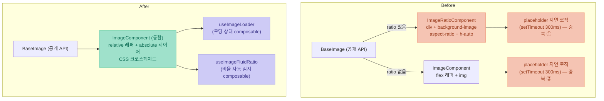

# Image Component Refactoring — flex 의존성 제거와 CSS 크로스페이드

> **TL;DR** — [1편](/posts/troubleshooting-and-refactoring/aspect-ratio-troubleshooting/)에서 사용처 수정으로 급하게 대응했던 Safari `aspect-ratio` fluctuation 문제를, 이번에는 디자인 시스템 이미지 컴포넌트의 구조 자체를 리팩토링해서 해결했다. ratio 유무로 갈라졌던 두 개의 컴포넌트를 하나로 통합하고, flex 컨테이너 의존성을 제거했으며, JS `setTimeout` 기반 placeholder 로직을 CSS transition 기반 **크로스페이드**로 대체했다. 그 결과 이미지 로직 코드가 절반으로 줄었고, Safari 레이아웃 흔들림이 구조적으로 재발할 수 없게 되었으며, 캐시 히트 시 즉시 렌더링·요청 취소·CLS 방지 등 로딩 파이프라인 전반의 성능이 개선되었다. `srcset` 기반 클라이언트 리사이징 등 남은 과제도 함께 정리했다.

---

## 배경 — 임시 조치에서 구조적 해결로

[1편: aspect-ratio Troubleshooting on Safari](/posts/troubleshooting-and-refactoring/aspect-ratio-troubleshooting/)에서 다뤘던 문제를 요약하면 다음과 같다.

- Safari는 `height`가 확정된 요소에서 `aspect-ratio`를 무시한다 (weak declaration)
- 중첩 flex의 `align-items: stretch` 기본값이 잘못된 높이를 `img`까지 전파한다
- 그 결과 이미지 로딩 중 레이아웃이 순간적으로 틀어졌다 복원되는 fluctuation이 발생한다

당시에는 **사용처에서** `aspect-ratio` prop 전달을 제거하고 `object-fit: cover`로 대체하는 방식으로 대응했다. 급한 불은 껐지만, 문제의 씨앗은 사용처가 아니라 **이미지 컴포넌트 자체의 구조**에 있었다. 컴포넌트가 flex 래퍼와 `img` 직접 비율 주입에 의존하는 한, 새로운 사용처가 생길 때마다 같은 지뢰를 밟을 수 있는 상태였다.

1편 말미에서 Chakra UI와 Next.js의 설계를 분석하며 도출했던 원칙 — **"비율은 wrapper가 갖고, `img`는 `absolute` + `object-fit`으로 채우기만 한다"** — 을 이번 리팩토링에서 컴포넌트 내부 구조로 내재화했다.

---

## 기존 구조와 문제점

리팩토링 전 이미지 컴포넌트는 `ratio` prop 유무에 따라 두 개의 내부 컴포넌트로 분기하는 구조였다.



이 구조에는 네 가지 문제가 겹쳐 있었다.

### 1. ratio 분기로 인한 컴포넌트 중복

`ratio` 처리 하나를 위해 컴포넌트가 두 개로 나뉘어 있었고, placeholder 지연 노출 로직(0.3초 이내 로드 시 placeholder 미표시)이 **두 파일에 동일하게 중복 구현**되어 있었다. 이미지 관련 기능을 하나 추가하려면 항상 두 파일을 같이 고쳐야 했다.

### 2. `background-image` 렌더링과 접근성 문제

ratio 버전은 `` 태그가 아니라 `div`에 `background-image`를 입히는 방식이었다.

```vue
<!-- Before: ratio 버전의 렌더링 -->
<div
  class="image"
  role="img"
  :alt="alt"  <!-- div의 alt는 스크린리더가 읽지 않는다 -->
  :style="{ backgroundImage: `url(${src})` }"
/>
```

`div`에 붙인 `alt` 속성은 표준이 아니므로 스크린리더가 읽지 않는다. 게다가 상위 공개 컴포넌트에서 `alt` prop이 내부로 전달조차 되지 않는 버그도 함께 있었다. 이미지이면서 이미지가 아닌 상태였다.

### 3. flex 컨테이너 의존성

일반 버전의 래퍼는 `display: flex; align-items: center; justify-content: center`였다. 1편에서 분석했듯 flex formatting context 안의 자식은 stretch 전파의 영향권에 들어간다. **컴포넌트가 스스로 Safari 버그의 전제 조건 위에 서 있었던 셈이다.** 사용처에서 아무리 조심해도 컴포넌트 내부에 flex 레이어가 하나 더 있는 한 근본 해결이 아니었다.

### 4. JS 타이머 기반 placeholder + 순차 페이드

placeholder 지연 노출이 `setTimeout` 300ms로 구현되어 있었다. 이 방식은 세 개의 상태(`loadStatus`, `showPlaceholder`, `placeholderTimer`)와 타이머 정리 코드를 요구한다.

```typescript
// Before: 컴포넌트마다 반복되던 상태 머신
const loadStatus = ref<LoaderStatus | null>(null);
const showPlaceholder = ref(false);
let placeholderTimer: ReturnType<typeof setTimeout> | null = null;

const handleLoadingStart = () => {
  clearPlaceholderTimer();
  showPlaceholder.value = false;
  loadStatus.value = null;
  placeholderTimer = setTimeout(() => {
    if (loadStatus.value !== "success") showPlaceholder.value = true;
  }, 300);
};

onBeforeUnmount(() => clearPlaceholderTimer()); // 잊으면 메모리 누수
```

또한 placeholder와 실제 이미지가 각각 별도의 Vue `<Transition>`으로 감싸여 **DOM 추가/제거 + 순차 페이드**로 전환되었기 때문에, 두 전환 사이에 아무것도 없는 빈 화면(흰색/투명)이 한 프레임 이상 노출될 수 있었다. 사용자에게는 이미지가 "번쩍"하고 바뀌는 것처럼 보인다.

---

## 개선 1 — 컴포넌트 통합과 composable 추출

먼저 구조 복잡성을 걷어냈다.

- ratio 전용 컴포넌트를 삭제하고 `ratio`를 통합 컴포넌트의 optional prop으로 흡수
- 로딩 상태 로직을 `useImageLoader` composable로 추출 — 세 개의 상태 + 타이머가 `loaded` boolean **하나**로 줄었다
- 비율 자동 감지 로직을 `useImageFluidRatio` composable로 분리

```typescript
// After: 로딩 상태의 전부
export function useImageLoader(emit: () => void) {
  const loaded = ref(false);
  const handleLoadingStart = () => {
    loaded.value = false;
  };
  const handleLoaded = () => {
    loaded.value = true;
    emit();
  };
  return { loaded, handleLoadingStart, handleLoaded };
}
```

상태가 이렇게까지 단순해질 수 있었던 것은 뒤에서 설명할 **"지연·전환·정리를 전부 CSS로 넘겼기"** 때문이다. JS가 관리할 것이 "로드됐는가" 하나만 남는다.

|                      | Before                      | After                |
| -------------------- | --------------------------- | -------------------- |
| Core 이미지 컴포넌트 | 2개 (일반 / ratio)          | 1개 (통합)           |
| placeholder 로직     | 두 파일에 중복              | composable 단일 소스 |
| 로딩 상태            | 상태 3개 + 타이머 + cleanup | `loaded` boolean 1개 |
| 이미지 로직 총량     | ~300줄                      | ~150줄 (**-51%**)    |

기능 추가의 진입점도 명확해졌다. 새 로딩 이벤트는 composable만, 새 시각 효과는 컴포넌트 한 곳만 수정하면 된다.

---

## 개선 2 — flex 의존성 제거: Safari 문제의 구조적 해결

1편의 결론이었던 wrapper 비율 제어 패턴을 컴포넌트 내부 구조로 채택했다.

```css
/* After: 래퍼 — 비율은 여기서만 제어 */
.image {
  position: relative;
  overflow: hidden;
  width: var(--image-width, 100%);
  height: var(--image-height, 100%);
}

.image--ratio {
  height: auto;
  aspect-ratio: var(--image-ratio, 1); /* wrapper에만 적용 */
}

/* 모든 레이어(placeholder, 실제 이미지)는 absolute로 겹친다 */
.image__placeholder,
.image__img {
  position: absolute;
  inset: 0;
  width: 100%;
  height: 100%;
  object-fit: var(--image-object-fit, cover);
}
```

핵심 포인트는 세 가지다.

**① `img`는 flex formatting context에서 완전히 이탈했다.** 모든 레이어가 `position: absolute`이므로 외부 flex의 `align-items: stretch`가 전파될 경로 자체가 끊어진다. 1편에서 Chakra UI가 같은 문제를 회피한 방식과 동일하다.

**② `aspect-ratio`는 wrapper에만, `img`에는 절대 주지 않는다.** wrapper는 `height: auto` + `aspect-ratio` 조합이므로 Safari의 `shouldComputeLogicalHeightFromAspectRatio()`가 `true`를 반환해 비율 계산이 정상 동작한다. `height` 확정값과 `aspect-ratio`가 충돌하는 1편의 케이스가 구조적으로 발생할 수 없다.

**③ `background-image`를 버리고 실제 `` 태그로 통일했다.** ratio 버전이 쓰던 `div + background-image + aspect-ratio + height: auto` 조합은 Safari에서 높이 재계산 루프를 유발하는 또 하나의 원인이었다. ``로 통일하면서 재계산 문제가 사라졌고, `alt`가 표준대로 동작하는 접근성 개선까지 함께 따라왔다. 크롭 방식은 `object-fit`을 CSS 변수로 열어 `cover`/`contain` 등을 외부에서 제어할 수 있게 했다.

사용처에서 어떤 flex 중첩 안에 배치하더라도, 컴포넌트가 자기 내부에서 비율과 레이어를 확정하기 때문에 fluctuation이 재발할 여지가 없다.

---

## 개선 3 — JS 타이머에서 CSS 크로스페이드로

전환 로직은 이번 리팩토링에서 가장 체감이 큰 부분이다. Vue `<Transition>`의 DOM 추가/제거 + JS 타이머 조합을 버리고, **두 레이어를 항상 겹쳐둔 채 `opacity`만 교차시키는** 순수 CSS 방식으로 바꿨다.

```css
/* placeholder: 기본 노출 → 로드 완료 시 fade-out */
.image__placeholder {
  transition: opacity var(--placeholder-fade-duration, 0.2s)
    var(--placeholder-fade-easing, ease-in);
}
.image__placeholder--loaded {
  opacity: 0;
}

/* 실제 이미지: 투명하게 대기 → 로드 완료 시 fade-in */
.image__img {
  opacity: 0;
  transition: opacity var(--image-fade-duration, 0.1s)
    var(--image-fade-easing, ease-out);
}
.image__img--loaded {
  opacity: 1;
}
```

템플릿에서는 `loaded` 하나로 양쪽 클래스만 토글한다. JS가 하는 일은 그것이 전부다.

|                  | Before (JS + Transition)              | After (CSS 크로스페이드)           |
| ---------------- | ------------------------------------- | ---------------------------------- |
| 전환 방식        | placeholder 제거 → 이미지 삽입 (순차) | 두 레이어 opacity 동시 교차        |
| 빈 화면 flash    | 발생 가능 (전환 사이 공백)            | 없음 (항상 한 레이어 이상 보임)    |
| 타이머/cleanup   | `setTimeout` + `onBeforeUnmount` 필수 | 없음                               |
| 메모리 누수 위험 | 있음 (타이머 정리 누락 시)            | 없음                               |
| 렌더링 비용      | DOM 추가/제거 → layout + paint        | `opacity`만 변경 → compositor 처리 |
| 커스터마이즈     | 컴포넌트 수정 필요                    | CSS 변수 (duration/easing)         |

이 방식의 성능적 이점도 분명하다. `opacity` 전환은 브라우저가 layout·paint 단계를 건너뛰고 compositor 스레드에서 처리하는 속성이라 메인 스레드를 건드리지 않는다. 반면 기존 방식은 전환 때마다 DOM 노드가 생기고 사라지면서 layout 재계산을 유발했다.

placeholder에는 기본 회색 박스 외에 `placeholderSrc` prop으로 **저화질 이미지(LQIP)** 를 지정할 수도 있다. 리스트에서 쓰던 작은 썸네일을 상세 화면의 placeholder로 재활용하면, 저화질 → 고화질로 자연스럽게 크로스페이드되는 점진적 로딩 UX가 컴포넌트 사용만으로 만들어진다. placeholder 이미지 자체가 실패하는 경우는 `@error`로 감지해 기본 placeholder로 폴백한다.

사용자 입장에서 이 전환은 "회색 → 이미지가 스르륵" 하나의 연속된 장면으로 보이기 때문에, **로딩이 진행 중이라는 사실을 직관적으로 인지**할 수 있다. 스피너나 빈 화면과 달리 "여기에 이미지가 온다"는 예고가 되기 때문이다.

---

## 개선 4 — 로딩 파이프라인의 웹 성능 개선

컴포넌트 구조와 함께 이미지 로더 유틸도 손봤다. 눈에 띄는 개선 네 가지를 정리한다.

### 캐시 히트 동기 감지 — 캐시된 이미지는 placeholder를 스킵한다

기존에는 캐시에 있는 이미지도 preload → 콜백 경로를 타면서 placeholder가 한 프레임 깜빡일 수 있었다. 브라우저 캐시 히트는 동기적으로 판별할 수 있다는 점을 이용했다.

```typescript
// 로딩 시작 전, 캐시 히트 여부를 동기 확인
const testImg = new Image();
testImg.src = src;
if (testImg.complete && testImg.naturalWidth > 0) {
  // 캐시 히트 → placeholder 없이 즉시 표시
  showImage();
  return;
}
// 캐시 미스 → placeholder 노출 + 비동기 preload
```

`complete`만 검사하면 안 된다는 것이 함정이었다. **에러 응답도 `complete === true`가 되기 때문**에, `naturalWidth > 0`까지 확인해야 유효한 캐시만 통과시킬 수 있다.

### 진행 중인 요청의 취소 — race condition과 무한 대기 방지

`src`가 빠르게 바뀌는 상황(캐러셀, 무한 스크롤 리스트 재사용 등)에서는 이전 preload가 끝나기 전에 새 preload가 시작된다. 진행 중인 `Image` 객체를 추적해서 새 요청 시작 시 이전 요청의 `src`를 비워 다운로드를 중단시키고, 늦게 도착한 응답이 최신 이미지를 덮어쓰지 못하게 현재 객체와의 일치 여부를 검사한다.

컴포넌트 unmount 시에는 pending 상태의 preload Promise를 명시적으로 reject해서, `await` 중인 비동기 함수가 영원히 매달려 있지 않도록 했다. 이미 사라진 컴포넌트를 참조하는 클로저가 GC되지 못하는 누수 경로를 함께 차단한 것이다.

### preload → `src` 교체 — 중복 다운로드 없는 전환

preload가 완료되면 화면의 `` 엘리먼트에 같은 `src`를 직접 할당한다. 이미 HTTP 캐시에 들어간 리소스이므로 네트워크 요청 없이 즉시 그려진다. 기존 `background-image` 방식과 달리 preload 결과가 그대로 재사용되는 구조다.

### 로드 전 공간 확정 — CLS 방지

비율(`ratio`)이 wrapper에서 CSS로 확정되므로, 이미지가 도착하기 전에도 레이아웃 공간이 예약된다. 이미지 로드가 layout shift를 만들지 않는다 — Next.js `<Image>`가 `width`/`height` 필수 prop으로 달성하는 것과 같은 효과다.

비율을 미리 알 수 없는 이미지를 위해서는 `naturalSize` 옵션을 추가했다. 이미지의 natural size를 감지해 `aspect-ratio`를 자동 적용하고, 감지 전까지는 `placeholderHeight`로 지정된 높이를 유지해 shift를 최소화한다.

---

## Before / After 종합 비교

| 항목                | Before                            | After                             |
| ------------------- | --------------------------------- | --------------------------------- |
| 컴포넌트 구조       | ratio 유무로 2개 분기             | 1개 통합 + composable 2개         |
| 이미지 로직 코드량  | ~300줄                            | ~150줄 (-51%)                     |
| 래퍼 레이아웃       | `flex` (stretch 전파 영향권)      | `relative` + `absolute` 레이어    |
| 비율 제어           | `img` 또는 `background-image` div | wrapper `aspect-ratio` (CSS 변수) |
| Safari fluctuation  | 사용처에 따라 재발 가능           | 구조적으로 차단                   |
| ratio 이미지 렌더링 | `div + background-image`          | 표준 `` + `object-fit`       |
| placeholder 지연    | JS `setTimeout` 300ms + cleanup   | 캐시 감지 + CSS transition        |
| 전환 효과           | 순차 페이드 (빈 화면 flash)       | CSS 크로스페이드                  |
| 저화질 placeholder  | 미지원                            | `placeholderSrc` (LQIP)           |
| 캐시 히트           | preload 경로 통과 (깜빡임)        | 동기 감지 → 즉시 표시             |
| 요청 취소           | 없음                              | src 변경/unmount 시 취소          |
| CLS                 | 비율 미확정 케이스에서 발생       | wrapper 비율 확정 + naturalSize   |
| 접근성              | `div role="img"` + alt 미전달     | 표준 `` + alt 정상 전달      |

---

## 마무리, 그리고 남은 과제

"Safari에서만 레이아웃이 흔들린다"는 한 줄짜리 버그 리포트가 여기까지 왔다. 1편에서 브라우저 엔진의 `aspect-ratio` 해석 차이를 파고들 때만 해도, 그 내용이 컴포넌트 설계 기준이 되어 돌아올 줄은 몰랐다. 사용처에서 급하게 prop을 걷어내던 hotfix가 "비율은 wrapper가, `img`는 채우기만"이라는 구조로 컴포넌트 안에 자리 잡기까지 — 그 과정의 기록이 이 시리즈다.

다만 이번 리팩토링으로 이미지 컴포넌트가 완성됐다고 생각하지는 않는다. 지금 진행 중인 것과 하고 싶은 것들이 남아 있다.

- **`srcset` + x-descriptor 기반 클라이언트 리사이징 (진행 중)** — 지금은 화면에 그려지는 크기나 디바이스 픽셀 밀도(DPR)와 무관하게 같은 해상도의 이미지를 받는다. 또한 이미지 사이즈 처리를 서버에서 하고 있는데, 서버에서 이미지 사이즈 처리를 누락할 경우 사용자에게 고용량의 원본 이미지를 그대로 노출하는 문제점을 안고 있다. 서버 처리 병목 해결 및 성능 개선을 위해 이미지 리사이징 처리를 클라이언트에서 관리 포인트를 갖고 진행하는 필요성이 대두되었다. 이를 클라이언트에서 처리하기 위해 `srcset`의 x-descriptor로 배율별(1x/2x/3x) 후보를 내려주고 브라우저가 환경에 맞는 해상도를 직접 고르게 하는 리팩토링을 함께 진행하고 있다. 네트워크 전송량과 디코딩 비용을 같이 줄이는 것이 목표다. 클라이언트 요청 포인트가 만들어지면 향후 리소스가 여유로울 때 DevOps & 백엔드 팀의 지원을 받아 클라이언트에서 적절한 이미지를 OnDemand로 생성 및 요청하는 구조로 최종적인 개선도 가능해질 것이다. 이를 위한 기본 발판을 마련하고 있다.
- **페이드 애니메이션 on/off 옵션** — 크로스페이드가 항상 정답은 아니다. 아이콘처럼 작고 즉각적으로 떠야 하는 이미지에는 전환 효과가 오히려 거슬릴 수 있어서, 애니메이션을 끌 수 있는 옵션을 검토하고 있다.
- **placeholder 정책 다듬기** — placeholder가 굳이 필요 없는 사용처에서도 기본값이 노출되는 케이스가 있다. 기본값과 노출 조건은 실제 사용처 피드백을 받으며 조정해 나갈 예정이다.

---

## 관련 자료

- [1편 — aspect-ratio Troubleshooting on Safari](/posts/troubleshooting-and-refactoring/aspect-ratio-troubleshooting/)
- [MDN — aspect-ratio](https://developer.mozilla.org/en-US/docs/Web/CSS/aspect-ratio)
- [MDN — HTMLImageElement.complete](https://developer.mozilla.org/en-US/docs/Web/API/HTMLImageElement/complete)
- [web.dev — Cumulative Layout Shift (CLS)](https://web.dev/articles/cls)
- [web.dev — Stick to Compositor-Only Properties](https://web.dev/articles/stick-to-compositor-only-properties-and-manage-layer-count)
- [Chakra UI — Image 컴포넌트](https://chakra-ui.com/docs/components/image)
- [Next.js — Image 컴포넌트](https://nextjs.org/docs/app/api-reference/components/image)
- [LQIP — Low Quality Image Placeholders](https://www.guypo.com/introducing-lqip-low-quality-image-placeholders)
